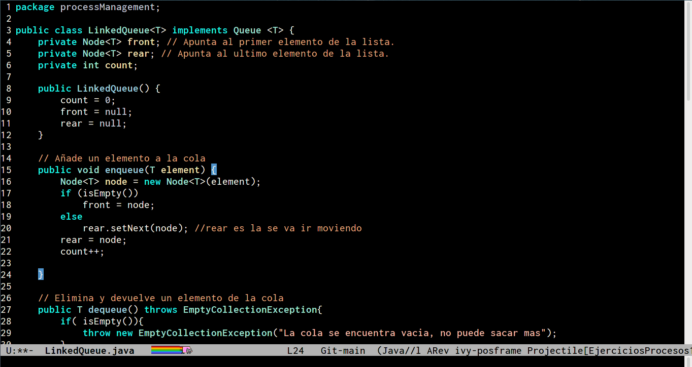

# Niklaus theme
Tema para emacs, el nombre es en honor al Cientifico de la Computación [Niklaus Wirth](https://en.wikipedia.org/wiki/Niklaus_Wirth)

>  Algoritmos + estructuras de datos = programas

Niklaus Wirth fue el jefe de diseño de los lenguajes de programación Euler, Algol W, Pascal, Modula, Modula-2 y Oberon. También ocupó gran parte de su tiempo en el equipo de diseño e implementación de sistemas operativos Lilith y Oberon para el Lola en el diseño del hardware digital y el sistema de simulación.

Su artículo de desarrollo de un programa por refinamiento sucesivo **program development by stepwise refinement** se considera un texto clásico en la ingeniería del software, así como su libro **Algoritmos + Estructuras de datos = Programas** que recibió un amplio reconocimiento, y que aún hoy resulta útil en la enseñanza de la programación. Recibió el Premio Turing en 1984, este es el más prestigioso premio que puede recibirse en el campo de la computación, y es entregado anualmente por la ACM.

## Settings
Clonar el repositorio en tu carpeta de themes y agregar en tu init.el

~~~
(add-to-list 'custom-theme-load-path "~/.emacs.d/initFileEmacs/myThemes/Liskov-theme")
(load-theme 'liskov t)
~~~

### Articulos
<https://computerhistory.org/profile/niklaus-wirth/>
